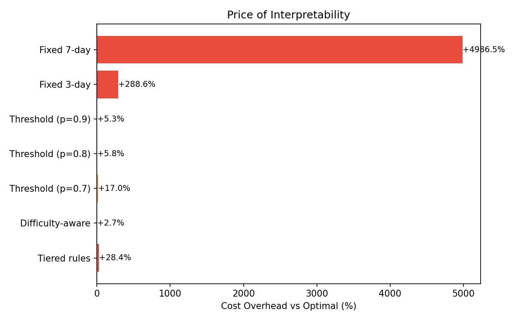

# Optimal Spaced Repetition Scheduling via Stochastic Shortest Path MDPs

**How much do you lose by replacing an optimal 95-entry scheduling table with a rule a human can state in one sentence?** About 2.7%.

Sanjida Nasreen, Morgan Lan

---

## Overview

Given a flashcard, when should it be reviewed next? Review too early and effort is wasted on something already known; review too late and the item must be relearned at roughly 3× the cost. We model this as a **stochastic shortest path MDP** over memory state, solve it exactly with value iteration, and then ask a second question that the prior literature does not: can a simple, human-followable rule substitute for the optimal policy? We call the performance gap the **price of interpretability**.

Memory dynamics come from the **DHP (Difficulty–Halflife–Probability)** model of Ye et al. (2022) and Su et al. (2023), whose constants were fitted on 220 million learning interactions from MaiMemo. We use those fitted parameters directly, so transitions reflect measured human forgetting rather than invented numbers.

## Model

| Component | Specification |
|---|---|
| State | `(h, d)` — memory half-life × item difficulty |
| State space | 19 log-spaced half-life bins × 5 difficulty levels + 1 terminal = **96 states** |
| Actions | Review interval ∈ {1, 2, 3, 5, 7, 10, 14, 21, 30, 45, 60} days (**11 actions**) |
| Recall model | `P(recall) = 2^(−a/h)` |
| Cost | `c(s,a) = p·3 + (1−p)·9` |
| Terminal | Mastery at `h ≥ 360` days |
| Criterion | Minimize expected discounted cost, γ = 0.99 |

Value iteration converges in **76 iterations** to a Bellman error below 1e−6, in under a second.

## Key results

Simulation over 500 episodes per difficulty level (2,500 episodes per policy):

| Policy | Avg Cost | Reviews | Recall% | Mastery% | Days | Δ vs Optimal |
|---|---|---|---|---|---|---|
| **Optimal (VI)** | 35.1 | 8.7 | 84.7% | 100% | 71 | — |
| Difficulty-aware | 36.0 | 8.9 | 84.4% | 100% | 98 | **+2.7%** |
| Threshold p\*=0.9 | 36.9 | 9.4 | 85.4% | 100% | 96 | +5.3% |
| Threshold p\*=0.8 | 37.1 | 8.4 | 77.5% | 100% | 125 | +5.8% |
| Threshold p\*=0.7 | 41.0 | 8.4 | 69.3% | 100% | 133 | +17.0% |
| Tiered rules | 45.0 | 9.1 | 70.2% | 100% | 101 | +28.4% |
| Fixed 3-day | 136.2 | 28.9 | 80.0% | 100% | 87 | +288.6% |
| Fixed 7-day | 1783 | 201 | 16.2% | 44.3% | 663 | +4987% |

**Three findings:**

1. **Interpretability is nearly free.** "Review at ~85% recall, sooner for harder items" costs +2.7% over a 95-entry optimal lookup table.
2. **But adaptivity is not optional.** Fixed 7-day scheduling reaches mastery in only 44.3% of episodes and costs ~50× optimal. The gap between *some* memory-state feedback and *none* is enormous; the gap between simple feedback and optimal feedback is small.
3. **The optimal policy is not monotone.** We found 26 violations in the half-life direction and 25 in the difficulty direction. The cause is the `(1−p)^0.97` term in the DHP recall update: a hard retrieval strengthens memory more, so the scheduler sometimes deliberately lets recall probability fall further before reviewing. A linear memory model would yield a perfectly monotone policy — the nonlinearity of the empirically fitted model changes a qualitative structural property, not just the numbers.

<p align="center">
  
</p>

## Repository structure

```
.
├── src/
│   ├── memory_model.py     # DHP forgetting curve + half-life update rules
│   ├── mdp.py              # State/action spaces, transition matrices, cost structure
│   ├── value_iteration.py  # Bellman solver + monotonicity analysis
│   ├── threshold_policies.py  # Interpretable policies + policy evaluation
│   ├── simulator.py        # Monte Carlo episode simulation
│   └── main.py             # Full pipeline: build → solve → simulate → plot
├── report/
│   └── project_report.pdf  # Written report
├── results/                # Generated figures
├── requirements.txt
├── LICENSE
└── README.md
```

Output paths are anchored to the repo root via `__file__`, so `results/` is written to the same place regardless of which directory you invoke the code from.

## Running it

```bash
git clone https://github.com/<your-username>/<your-repo>.git
cd <your-repo>
python -m venv .venv && source .venv/bin/activate   # Windows: .venv\Scripts\activate
pip install -r requirements.txt
python src/main.py
```

Runtime is dominated by the 20,000 simulated episodes. All figures are written to `results/`.

Individual modules also run standalone for inspection:

```bash
python src/memory_model.py        # forgetting curve demo
python src/mdp.py                 # state space summary + example transitions
python src/value_iteration.py     # optimal policy table + monotonicity report
python src/threshold_policies.py  # print each interpretable policy as a table
```

## Figures

| | |
|---|---|
| `results/optimal_policy_heatmap.png` | Optimal interval per (half-life, difficulty) state |
| `results/value_function.png` | V(s), expected cost to mastery |
| `results/convergence.png` | Bellman error per iteration (log scale) |
| `results/comparison.png` | Cost, review burden, and recall % across all policies |
| `results/price_of_interpretability.png` | Cost overhead vs optimal |
| `results/difficulty_breakdown.png` | Cost by difficulty level for four policies |

## Relation to prior work

Tabibian et al. (2019) treat scheduling as continuous-time stochastic optimal control; Settles & Meeder (2016) introduced half-life regression at Duolingo; Ye et al. (2022) formulated SSP-MMC and deployed it at MaiMemo. All three optimize the schedule. None ask what is lost by simplifying the result into a rule a learner can follow, which is the question this project addresses.

Our formulation is a deliberate reduction of SSP-MMC (2,736 states, C++ solver, 200,000 iterations) to 96 states, so that every entry of the optimal policy can be inspected directly.

## Limitations

A single item is modeled in isolation. Real systems schedule thousands of items against a limited daily review budget, which makes it a constrained MDP where items compete for the learner's time — plausibly requiring Lagrangian relaxation or constrained-MDP methods. The coarser discretization (96 vs 2,736 states) may also smooth out structure present in the original.

## References

1. Ye, J., Su, J., & Cao, Y. (2022). A stochastic shortest path algorithm for optimizing spaced repetition scheduling. *KDD '22*, 4381–4390.
2. Su, J., Ye, J., Nie, L., Cao, Y., & Chen, Y. (2023). Optimizing spaced repetition schedule by capturing the dynamics of memory. *IEEE TKDE*, 35(10), 10085–10097.
3. Settles, B., & Meeder, B. (2016). A trainable spaced repetition model for language learning. *ACL '16*, 1848–1858.
4. Tabibian, B., Upadhyay, U., De, A., Zarezade, A., Schölkopf, B., & Gomez-Rodriguez, M. (2019). Enhancing human learning via spaced repetition optimization. *PNAS*, 116(10), 3988–3993.
5. Puterman, M. L. (2014). *Markov Decision Processes: Discrete Stochastic Dynamic Programming*. Wiley.
